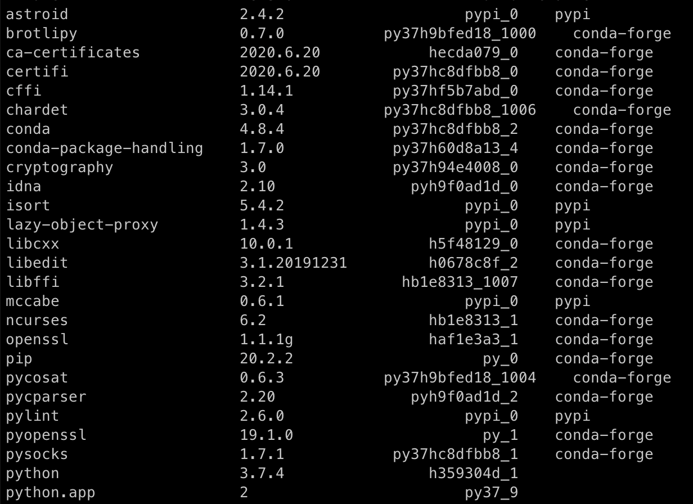

Use this guide to clean a messy package environment without reinstallation of conda or pip.

Uninstall all pip packages on system:

```
pip freeze | xargs pip uninstall -y
```

Conda packages can be removed one by one using the standard syntax. Sometimes, a mixed conda/pip system will result in a package list that looks like the image below.



Conda does not let you normally interact with these packages and pip cannot see them, this then leaves you unable to remove them. To force conda to interact with conda installed pip packages use the command:

```
CONDA_PIP_INTEROP_ENABLED=1 conda remove <PACKAGE_NAME>
```